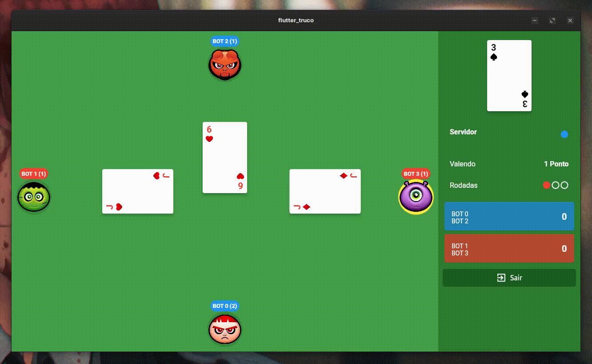

## Etiquetas

Adicione etiquetas de algum lugar, como: [shields.io](https://shields.io/)

[](https://choosealicense.com/licenses/mit/)

# Flutter Truco Game (Network)

The flutter game with connection in network (localhost and intranet)

## Screenshots



## Rodando localmente

Clone o projeto

```bash
  git clone https://github.com/ayusuke7/FlutterTruco
```

Entre no diretório do projeto

```bash
  cd FlutterTruco
```

Instale as dependências

```bash
  flutter pub get packages
```

Inicie o servidor

```bash
  flutter run android or
  flutter run ios
```

Obs: Don't work with Web

## Change Board and Barries

The board is mounted based in list with int, when 1 is path and 0 is barried
Obs: enemys its setted in game loop with number 2

## Autores

- [@ayusuke7](https://github.com/ayusuke7)
