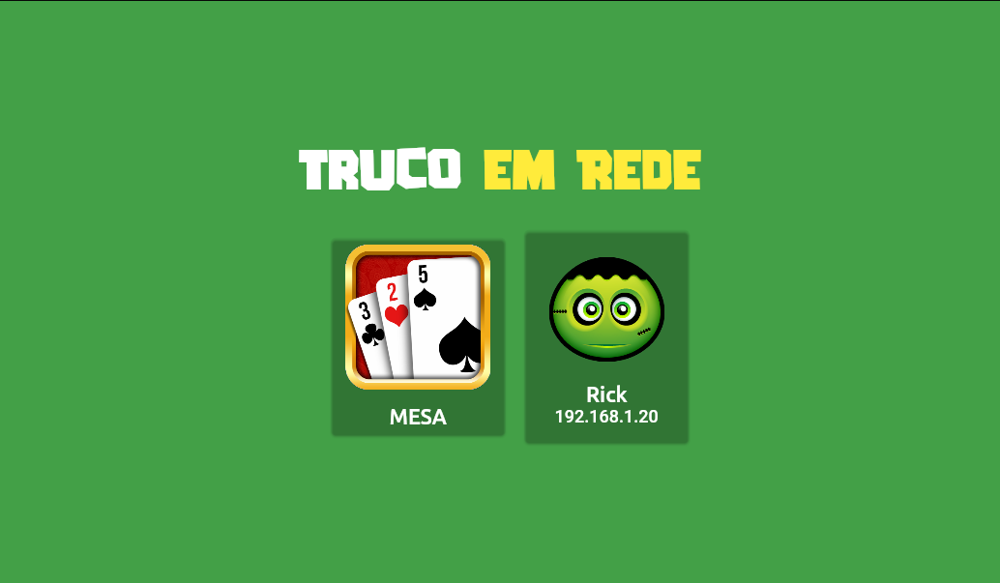
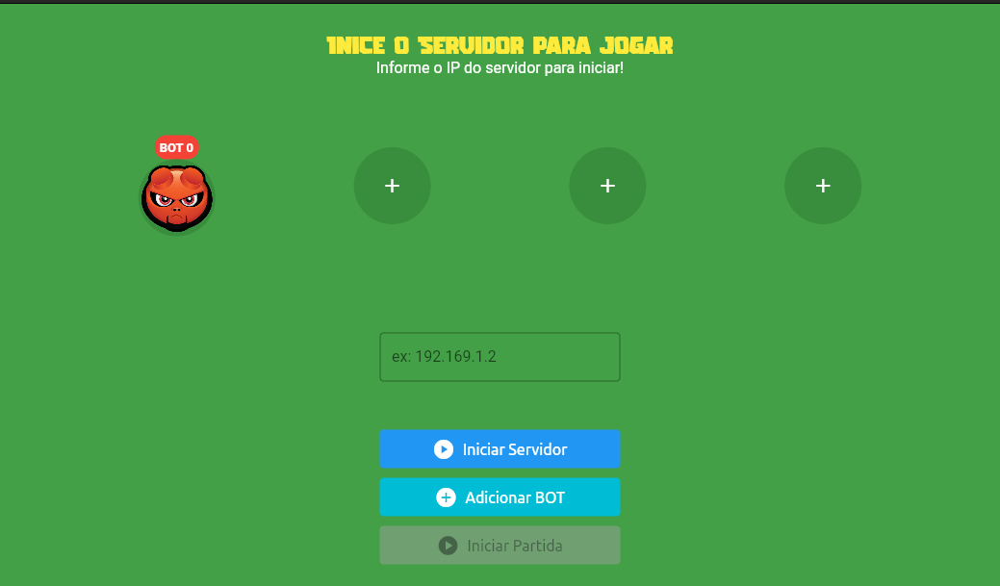
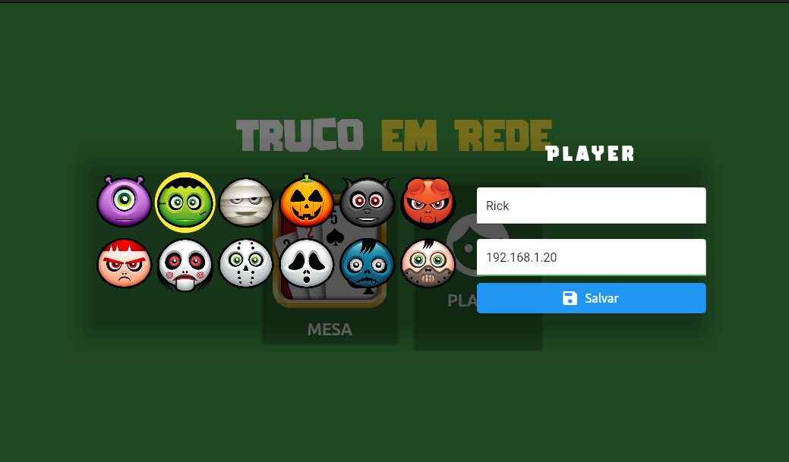

## Etiquetas

Adicione etiquetas de algum lugar, como: [shields.io](https://shields.io/)

[](https://choosealicense.com/licenses/mit/)

# Flutter Truco Game (Network)

The flutter game with connection in network (localhost and intranet)

## Screenshots


## Rodando localmente

Clone o projeto

```bash
  git clone https://github.com/ayusuke7/FlutterTruco

  cd FlutterTruco

  flutter pub get

  flutter run
```

Obs: Don't work with Web

## Usage

The Game use connection Server/Client in localhost or intranet.

It is possible to choose between Table and Player when starting the game.

The game needs you to start the server on some device. The server will wait for the others to connect up to a total of 4 devices.



### Table Mode

Initialize GameTruco with instance of Player() can that is "auto" or "host" specification address of the player.;

```dart
new Player({
  host: 192.168.1.10,
  name: "Rick"
});
```

or Bot player

```dart
new Player({
  auto: true,
  name: "I'm Bot"
});
```



### Player Mode

Initialize PlayerTruco with instance of CreatePlayerModel()
specification address of the player.;

Example:

```dart
PlayerTruco(
  model: CreatePlayerModel(
    host: '192.168.1.10',
    name: 'Rick'
  ),
)
```



## Autores

- [@ayusuke7](https://github.com/ayusuke7)
